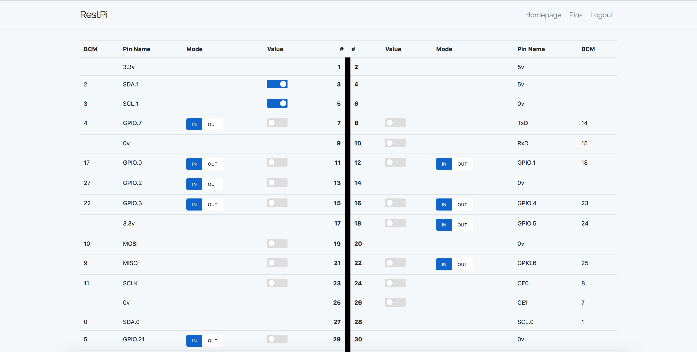

# RestPi
RestPi is a django restful project. It developed for remote controlling to Raspberry Pi. It has front-end for pin controlling. Front-end developed with angularjs.

## Installation
```bash
git clone https://github.com/ahmetkotan/restpi.git
cd restpi/
./install.sh
```
RestPi is running on production mode. For development mode;
```bash
cp restpi/settings/local.py.sample restpi/settings/local.py
```
And starting;
```bash
python manage.py runserver 0.0.0.0:8000
# or
nohup python manage.py runserver 0.0.0.0:8000 &
```

## Screenshot


## API Usage for Developers
All users can view pin statuses. But just registered users can change pin statuses. 

### Login/Logout
Token's expiration time is 3 days.
```bash
curl -X POST -d '{"username": "<username>", "password":"<password>"}' -H "Content-Type: application/json" <raspi-url>/tokens/
```
```json
{
    "token": "<a-f0-9>{64}"
}
```
```bash
curl -X DELETE -H "Content-Type: application/json" -H "Authorization: Bearer <token>" <raspi-url>/tokens/
# status code 204 (No Content)
```
See also for login/logout; [ahmetkotan/tokenauth](https://github.com/ahmetkotan/tokenauth)

### Get All Pin Statuses
```bash
curl -X GET -H "Content-Type: application/json" <raspi-url>/pins/api
```
```json
{
    "count": 40,
    "next": null,
    "previous": null,
    "results": [
	    ...
        {
            "BCM": null,
            "name": "3.3v",
            "value": null,
            "mode": null,
            "is_gpio": false,
            "physical": 1
        },
        ...
    ]
}
```
### Get Single Pin Status
```bash
curl -X GET -H "Content-Type: application/json" <raspi-url>/pins/api/<pin_physical_no>
```
```json
{
    "BCM": 17,
    "hr_mode": "IN",
    "name": "GPIO.0",
    "hr_value": "LOW",
    "value": 0,
    "mode": 1,
    "is_gpio": true,
    "physical": 11
}
```

### Change Pin Mode and Value
```bash
curl -X POST -d '{"mode": 0/1}' -H "Content-Type: application/json" -H "Authorization: Berarer <token>" <raspi-url>/pins/api/<pin_physical_no>
curl -X POST -d '{"value": 0/1}' -H "Content-Type: application/json" -H "Authorization: Berarer <token>" <raspi-url>/pins/api/<pin_physical_no>
curl -X POST -d '{"mode": 0/1, "value": 0/1}' -H "Content-Type: application/json" -H "Authorization: Berarer <token>"  <raspi-url>/pins/api/<pin_physical_no>
```
```json
{
    "operation": true,
    "pin": {
        "BCM": 17,
        "hr_mode": "OUT",
        "name": "GPIO.0",
        "hr_value": "HIGH",
        "value": 1,
        "mode": 0,
        "is_gpio": true,
        "physical": 11
    }
}
```

See also; `postman_tests/`
